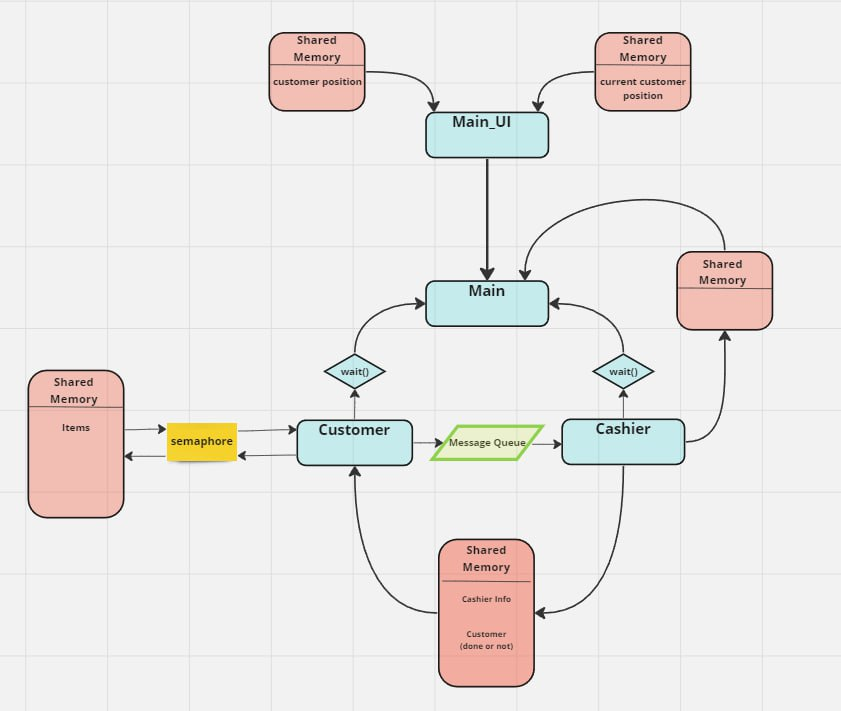

# Project #1: Interprocess communication techniques under Linux


https://github.com/hammamProg/RealTime-First-Project/assets/65830885/9a61e1b3-b545-457a-bac3-8b7996066e7e


## 🚀 Description

This project is our first one in the RealTime, in this project we utilize our knowledge in IPC (interprocess communication techniques) to make a supermarket simulation which is represent a multi processing system, in the following figure we try to explain the relationship between the processes.  


<p align="center">

</p>


## 👥 Team Members

- [Eng. Hammam Khaled](https://github.com/hammamProg) 🚀
- [Eng. Abdallah Mohammad](https://github.com/abdallahdaoud) 💡
- [Eng. Mahmoud Atia](https://github.com/mahmoud024) 🌟

## 🛠️ Installation

This project is specifically designed to work on Mac. Follow the steps below to install:

1. **Step 1**
   ```bash
    # Clone the repository
    git clone https://github.com/hammamProg/RealTime-First-Project

    # Navigate to the src/ directory
    cd RealTime-First-Project/src/

    # Run make all
    make all


---

**Feel free to ⭐️ this repository if you find it helpful!**
